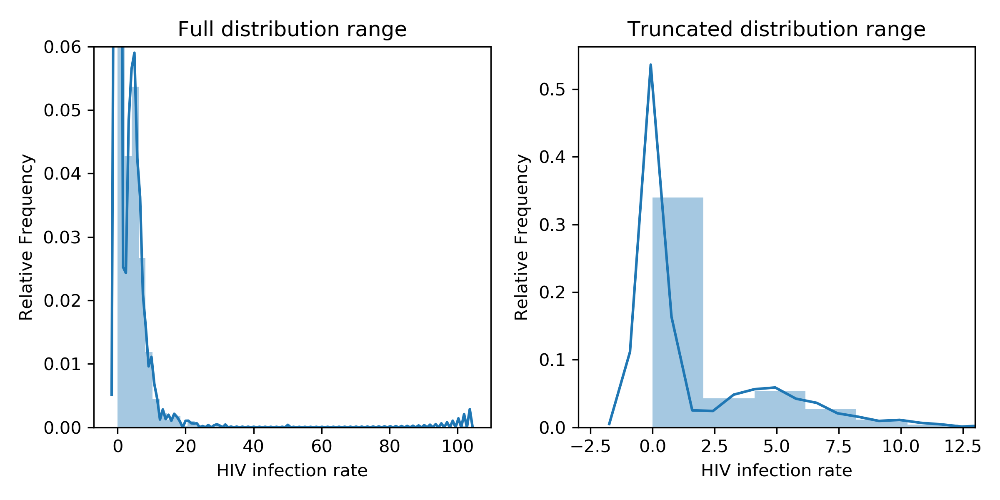
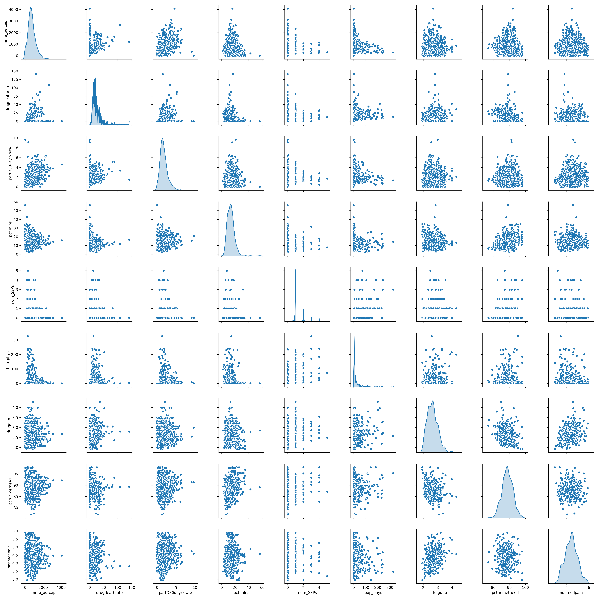
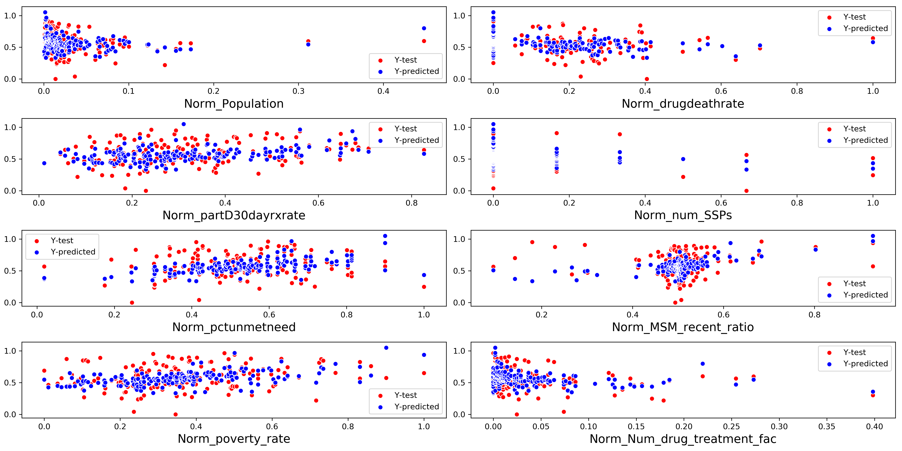

# Forecasting-HIV-Infections Case Study

## Case Study Goal
    1) To accurately model HIV incidences (new infections per 100,000) in US counties by building a linear regression model that utilizes HIV infection data, census data, data on the opioid crisis, and data on sexual orientation.
    2) Identify features that are the most significant drivers of HIV infection rates and learn how these drivers differ between different regions.

# Table of contents
1. [Background](#background)
2. [Data Sources](#data)
    1. [Credit](#credit)
3. [Approach](#approach)
4. [Exploratory Data Analysis](#eda)
5. [Feature Engineering](#features)
6. [Model Selection](#model)
    1. [Automate Model Optimization](#automate)
    2. [Test Model Performance](#performance)
7. [Evaluate feature selection and importance](#importance)
8. [Conclusions](#conclusions)
9. [Other Files](#other)
    

## Background 
Due to the development of anti-retroviral therapies the HIV/AIDS epidemic is generally considered to be under control in the US. However, as of 2015 there were 971,524 people living with diagnosed HIV in the US with an estimation of 37,600 new HIV diagnoses in 2014. HIV infection rates continue to be particularly problematic in communities of color, among men who have sex with men (MSM), the transgender community, and other vulnerable populations in the US. Socioeconomic factors are a significant risk factor for HIV infection and likely contribute to HIV infection risk in these communities. The current US opioid crisis has further complicated the efforts to combat HIV with HIV infection outbreaks now hitting regions that weren’t previously thought to be vulnerable to such outbreaks.

A model that can accurately forecast HIV infection rates would be beneficial to local public health officials. Provided with this information, these officials will be able to better marshal the resources necessary to combat HIV and prevent outbreaks from occurring. Accurate modeling will also identify risk factors for communities with high HIV infection rates and provide clues as to how officials may better combat HIV in their respective communities.

## Data Sources 
The ./data folder contains data from three publically available sources. Groups should feel free to supplement this data if they wish.

The largest collection of HIV and opioid data was obtained from the opioid database maintained by the American Foundation for AIDS Research (amfAR).
Demographic and economic data were obtained from the 5yr - American Community Survey which are available at the US census bureau website.
Estimates for the MSM population in each county were obtained from the Emory Coalition for Applied Modeling for Prevention (CAMP).
Data dictionaries that indicate what each column in the data means are included in the folder associated with each data set.

## Credit 
This case study is based on [Eric Logue's capstone project.](https://github.com/elogue01/Forecasting-HIV-Infections)

For this case-study, the above github project was used as a source of data. To expedite the cleaning and aggregating, source of code corresponding to data cleaning and merging from the merge_data.ipnb notebook were used. Everything beyond that code is original work.

## Approach 
* **Exploratory Data Analysis**: Perform brief Exploratory Data Analysis to understand the scope of the data and decide upon appropriate model type based on data and case study goals.
* **Feature Engineering**: Transform, combine and develop novel features for use in modeling.
* **Model Selection**: To meet case study goals, the model should allow for extrapolation of the impact of any feature on the total HIV infection rate. This suggests linear models as a logical initial approach. Questions on root causes of HIV infection rates necessitate using models with a higher degree of interpretability. 
* **Automate Model Optimization**: The scale of features in this data set suggest the use of automated feature selection to mitigate the iterative human effort and potential bias of huamn model optimization.
* **Test model performance**: Train/test split of data allows for evaluation of performance both in model optimization and meaure model performance of unseen data and suggest real-world performance.
* **Evaluate feature selection and importance**: Determine the contribution of features to model predictions. A goal of this case-study is to determine features that lead to increased HIV infection rates. 

## Exploratory Data Analysis 

The initial dataframe from the github repo corresponded to merged and county-aggregated data from several sources. This comprised 38 features for over 3,200 counties with aggregate measurements from each county for the year 2015. Initial evaluation of features found several features that were based on eachother, with high multicolinearity between features. Additionally, several features exist that would allow for data leakage on the prediction target. Features could be loosely grouped as features associated with: 
* drug use and availability
* substance abuse/addiction support and treatment
* income and income distribution
* male homosexual activity rates

Evaluation of features within these categories found a high degree of colinearity between some features. Features with several colinear relationshsips were excluded from use in modeling. Excluding features that would promote data leakage and high colinearity resulted in a 20% reduction in the number of features and included only those without high degress of colinearity.

## Feature Engineering 

The reduced set of features were used as the basis for feature engineering to aggregate relevant features, produce new features for modeling, and create the feature to be used as the prediction target. Rather than predicting the rate per capita rate of HIV infection, I engineered a feature for the growth rate or rate of decrease for HIV infection. This feature allows for reduced opportunities for data leakage and can be more easily extrapolated to the impact of each feature. Several features with sparse but highly related data were aggregated to allow for broader regional comparisons. 

Interestingly, a large amount of the counties had no incidence of existing HIV infection and no new infection. Only a single county reported a new HIV infection without prior HIV infection in the county. Additionally, there are a few counties with extremely high rates of infection. The following figure visualizes the distribution of HIV infection rates across US counties.

 

This zero-value data is problematic for use in modeling HIV infection and was discarded for use in building a model. This reduced the data set by 77%, and reduces data to only that which is useful in modeling increased HIV infection rate. The high value of HIV infection rate correspond to counties with numerous divergent data, show infection rates 25x greater than the median infection rate, and compromise approximately 1% of entries. These values will heavily skew the model and represent a very small fraction of the data, and were also excluded from use in modeling. These engineered features were used for additional Exploratory Data Analysis and to contruct models. This dataset includes 28 features with 719 observations for each feature.

## Model Selection 

Initial EDA on the data, the total number of possible features, and the requirement for an easily interpreted model suggested the use of a linear regression as a first approach. The EDA process reduced the number of features to 28, which includes approximately 2/3 original features and 1/3 engineered features. Visualization of sub-groups of features suggests possible linear relationships between several features, which can be seen in the following scatter-matrix/pair-plot showing drug-related features. A cursory examination will show that many features have what appears to be linear relationships, which might be well modeled with a relatively simple linear model.

 

There are a mixtures of continuous and discrete features within this feature sub-set, and this trend was continued in other features in the data.  Due to the large number of features, I elected to employ linear regression models with auto-selecting features. I chose two separate approaches: stepwise backward elimination and lasso/ridge regression.  Stepwise backward elimination is an iterative process in which all features are used to create a linear regression, a p-value is calculated for each feature, and the worst feature is removed from the model.  The feature with the worst p-value, a metric for the probability of observing the feature if it was not related to the prediction target (HIV infection rate), was compared against a confidence threshold (95% confidence interval in this case) and removed from the model if it was above the threshold. The model was recreated now excluding the previously worst feature. This process continues iteratively until either no features are above the confidence threshold or removing the features does not improve the model. The second approach was Lasso regression. This is a type of linear regression that uses "shrinkage" where data values are shrunk towards a central point. As with the stepwise backward elimination, the lasso procedure encourages selects for fewer features by reducing the coefficient, essentially the impact of that feature on the prediction target, to zero and removing the feature from the model. Both of these approaches yield a simpler, and ideally stronger model performance but accomplish this in different ways.

The features selected from EDA were initially used in the stepwise backward elimination process. These features 14 were:
* **Population**: Estimate of total population by county from the US Census Bureau.
* **drugdeathrate**: The rate of death from drug poisoning, including both illicit and prescription drugs, per 100,000 population.
* **mme_percap**: The amount of opioids prescribed, in morphine milligram equivalents (MME) per population, which allows for direct comparison of different opioids.
* **partD30dayrxrate**: The number of standardized 30-day supplies of opioids reimbursed by Medicare Part D, per Medicare Part D enrollee.
* **pctunins**: Percent of the civilian noninstitutionalized population with no health insurance coverage.
* **num_SSPs**: Total number of syringe exchange programs. The directory of syringe exchange programs is aggregated by self-reporting and is therefore unlikely to be a comprehensive and complete list of all syringe exchange programs.
* **pctunmetneed**: Percent of total population needing but not receiving treatment for illicit drug use.
* **%msm12month**: The percent of the adult male population that has engaged in homosexual activity in the past 12 months.
* **MSM_recent_ratio**: A measure of change in the rate of male homosexual activity over the past 5 years.
* **poverty_rate**: Percent of the population below the US poverty level.
* **Mean income**: Average family income in the county, includes all definitions of "family" based on US tax code. 
* **Num_drug_treatment_fac**: The total number of facilities offering at least one drug-treatment regime.
* **Percent_men**: The percent of the population that is adult males.
* **income_ratio**: A measure of the distribution of incomes in the county, calculated from median and mean income family income.

## Automate Model Optimization 

A linear model using these features was trained using the stepwise backward elimination process, and the corresponding model have very promising adjusted R-squared value of 0.95, which is statistical measure that represents the proportion of the variance of the prediction target that can be explained by the features in the regression model. Further evaluation of this model found a large amount of multicolinearity that could potentially lead to a model that is overfit and performs extremely well on the data but will not perform well on the hold-out testing data used to assess model performance on unseen data. Further reduction of features was accomplished using the stepwise backward elimination process and resulted in a model that used only 5 features but still had an adjusted R-squared value of 0.95 with a large reduction in multicolinearity. The full data set using for training models, with 28 features, was also used to build a model using the stepwise backward elimination process, and resulted in a model using 6 features that with an adjusted R-squared value of 0.95 but this model still contained substantial multicolinearity.

## Test Model Performance  

Both the EDA-selected features and the full-feature set gave similar models after the stepwise backward elimination process, but tests of these models against hold-out unseen data did not show strong performance:

For an unseen dataset with a test mean of 5.39, the models had the following prediction error:
* EDA-selected model ± 5.31 (98.5% of mean)
* Stepwise-selected ± 5.4 (100.1% of mean)

While these models were able to predict the mean well, they had a very large error in those predictions, indicating the model was likely overfit to the training data.

These models also display a large amount of colinearity between features and have features were extremely different scales. A feature like population will have values in the tens of thousands, which other features are represented as fractions. As a means to remedy this, the data for training and analysing the model was normalized between a range of 0 to 1, which still retaining information about the relative amount of any feature for a given county. Using this normalized data, linear regression models were trained using the EDA-selected feature models and full-feature set, as well as the lasso regression. Interestingly, all three of these models yield similar performance metrics despite using somewhat different features. All three models showed adjusted R-squared values between 0.92 - 0.93, indicating strong ability to predict the target value, and all had essentially reduced any multicolinearity with the same or very similar features are used on the un-transformed data. Most importantly, all three models predicted extremely well on unseen test data: 

For an unseen dataset with the Normalized test mean was 0.57, the models had the following prediction error:
* Normalized EDA-selected model ± 0.025 (4.4% of mean)
* Normalized step-selected model ± 0.024 (4.2% of mean)
* Normalized lasso-selected model ± 0.026 (4.6% of mean)

These root-mean-squared-error values are a very strong metric of model performance, but it is also useful to visualize the model predictions against actual data. 

 

In the above chart, the true change in HIV infection rate is the X-coordinate for each point and the predicted change in HIV infection rate is the y-coordinate. Perfect prediction performance would be indicated by a diagonal line between the two axes with a slope of 1. Clearly, each model does not yield perfect performance, but the aggreage performance is strong. Interestingly, each model yields similar predictions with a similar distribution. 

Evaluation of residuals, error between the true value and a predicted value, can be used to determine if model predictions are accurate across a range of values for features. Shown below are the residuals for EDA-selected features model. The bottom right panel shows the residuals for the target of prediction and all other panels show the residuals for each feature. 

.png" width= '800' height= '400' />

Aside from the Population feature, other features show even distribution that suggests the error is evenly distributed across features and between features. And the prediction of the change in HIV infection rate ('predicted rel HIV infection rate') show uniform distribution of error, which is desired. Interestingly, the error for Population is non-uniform and indicates that the model performance could be improved by altering how this feature is employed in the model. 

While further refinement of model performance could be performed and may improve results, these results were deemed sufficient for this purpose, and would allow comparison of different features selected in the models as a means to understand factors that influent the rate of HIV infection. Visualizing predictions of the model and true data for each feature used for modeling indicate that the models tend to predict values closer to the mean and less extreme than true values, as can be observed with the tigher distribution of predicted target values (Y-predicted) relative to the true values (Y-test).

## Evaluate feature selection and importance 

However, given the overall performance of these models, the predictions seem strong enough to allow for comparison of the underlying causes of increased HIV infection, which can be investigated by examing the features and relative impact of those features on each model.  Models used betwen 7 - 9 features and only 14 total features are used by all three models. As shown in the following figure, many features are shared between models and when features differ the features are often representing similar information. Values above zero indicate that an increase in that feature will increase the rate of HIV infection, and values below zero indicate than an increase in that feature will decrease HIV infection rates.

Interestingly, all of these features were in the EDA process to select appropriate features.  The following features are predicted to increase the rate of HIV infection across all models:
* **poverty_rate**: Percent of the population below the US poverty level.
* **pctunmetneed**: Percent of total population needing but not receiving treatment for illicit drug use.
* **partD30dayrxrate**: The number of standardized 30-day supplies of opioids reimbursed by Medicare Part D, per Medicare Part D enrollee.
* **pctunins**: Percent of the civilian noninstitutionalized population with no health insurance coverage.
* **mme_percap**: The amount of opioids prescribed, in morphine milligram equivalents (MME) per population, which allows for direct comparison of different opioids.
* **Population**: Estimate of total population by county from the US Census Bureau.
* **MSM_recent_ratio**: A measure of change in the rate of male homosexual activity over the past 5 years.
* **income_ratio**: A measure of the distribution of incomes in the county, calculated from median and mean income family income.

These features suggest that HIV rate are strongly related to poverty, lack of medical treatment, and male homosexual activity. Interestingly, large population centers and income inequality are also strong correlated with increased HIV infection rates. 

The following features are associated with decreased HIV infection rates: 
* **num_SSPs**: Total number of syringe exchange programs. The directory of syringe exchange programs is aggregated by self-reporting and is therefore unlikely to be a comprehensive and complete list of all syringe exchange programs.
* **drugdeathrate**: The rate of death from drug poisoning, including both illicit and prescription drugs, per 100,000 population.
* **Num_drug_treatment_fac**: The total number of facilities offering at least one drug-treatment regime.
* **Mean income**: Average family income in the county, includes all definitions of "family" based on US tax code. 
* **%msm12month**: The percent of the adult male population that has engaged in homosexual activity in the past 12 months.
* **Percent_men**: The percent of the population that is adult males.

It is notable that while each model achieve similar performance, the selection and degree of impact of features is variable. Overall, our data set was focused on data related to poverty, drug abuse and treatment, and male homosexual activity and it is not surprising that aspects of all of this data are represented in each model. Interestingly, our results suggest that the number of drug treatment facilities are greater contributors to decreases in HIV infection rate, and should be an area of greater focus for the prevention of spread of HIV. 

## Conclusions 

HIV infection is a multifaced problem with several root causes. Many of these causes are either related to systemic socioeconomic issues or untreated drug addicition, especially to opiates drugs that are commonly used intravenously. The major infection routes are well established, but effective methods to reduce the spread of HIV infection are still a change. Separate approaches were used to generate models that all perform equally well in predicted changes in HIV infection rates with an prediction error of ± 4.4% of mean, with strong performance in other statistical metrics of model performance. These models all used for forms of automated feature selection, and used between 7-9 features in each model from a common set of 14 features. Interestingly, each model indicates that unmet need for drug addiction, high amounts of uninsured individuals, and increased rates of male homosexual activity are strong predictors of increased HIV infection while increased numbers of drug treatment facilities are the single most powerful feature for reducing HIV infection rates. Combined with funding for therapeutic regimes for HIV infected individuals without insurance, from this analysis it seems clear that investment in drug treatment for uninsured individuals is likely to have a strongly beneficial impact in reducing the rate of HIV infection. 

### Next steps
I do not plan to continue working on this case study beyond this point. But, potential follow up work would include:
1. Test current models based on county-wide data for the whole country on regional groupings of counties in the United States (North East, South East, North West, etc.) Do different regional factors necessitate region-specific models?
2. If model performance was poor, separate models for groups of regions could be created based on the stepwise backward elimination linear regression or a lasso regression used here. It is possible that these auto-selecting regressions may result in different feature selection and importance, which would be useful for understanding root causes and best approaches to mitigate HIV infection rates.
3. Evaluate predicted region-specific HIV growth rates, and extrapolation to number of individuals potentially effected to predict increased healthcare need and assist with allocation of resources.

## Other files 

A detailed Jupyter Notebook was created to walk through the process of exploratory data analysis, feature engineering, model selection, evaluating and visualizing model performance, and examination of feature importance. Corresponding scripts are also provided for each of those functions.